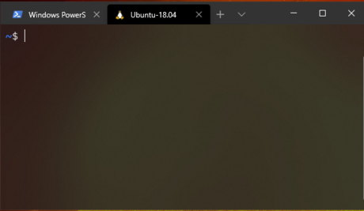
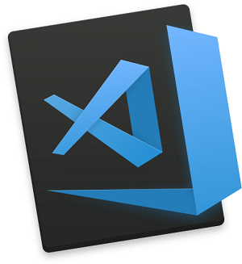
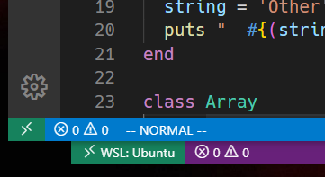

<!--prettier-ignore-start-->
# Installation Steps 
{: .no_toc }

In this module we will be installing both Ruby and Rails. We will also be setting up our development environment by installing and configuring a source-code editor.

## Table of Contents
{: .no_toc .text-delta }  

1. TOC
{:toc}

<!--prettier-ignore-end-->

## Installation Plan

There are two ways to get Rails running on Windows. We will start with the Windows Subsystem for Linux (WSL) and if that doesn't work we'll use Virtual Box.

For the WSL route the steps will be:

1. Install the new Windows Terminal.
2. Install Linux by way of the Windows Subsystem for Linux (WSL).
3. Install Ruby on the WSL.
4. Install Rails.
5. Configure Git.
6. Install and configure the VS Code editor.
7. Test out our installations.

## Install the Windows Terminal

{:class="small inline"}

The Windows Terminal is a replacement for the old `cmd.exe` command line application.

It is, according to Microsoft, "a modern, fast, efficient, powerful, and productive terminal application for users of command-line tools and shells like Command Prompt, PowerShell, and WSL."

You may already have the Windows Terminal installed. If not, you can [install it from the Windows Store](https://www.microsoft.com/en-ca/p/windows-terminal/9n0dx20hk701).

## Windows Subsystem for Linux

The Windows Subsystem for Linux (WSL) lets you run a GNU/Linux environment directly on Windows without the overhead of a traditional virtual machine or dualboot setup.

Let's install Ubuntu Linux version on the WSL!

- Open PowerShell as Administrator and run:

`dism.exe /online /enable-feature /featurename:Microsoft-Windows-Subsystem-Linux /all /norestart`

👆 Note: This is all one line.

- Next you should restart your machine.

- Finally go to the [WSL Store and install Ubuntu 18.04](https://www.microsoft.com/en-ca/p/ubuntu-1804-lts/9n9tngvndl3q).

- Run Ubuntu 18.04 from your start menu.

- Be sure to save the username and password you set for your WSL user account!

**⚠️ WARNING:** It's crucial that you install Ubuntu 18.04. The WSL currently has issues with Ubuntu 20.04.

### WSL Version Two is Optional

Feel free to update your WSL to the newly released WSL2 by [following these WSL2 update instructions](https://docs.microsoft.com/en-us/windows/wsl/install-win10#step-2---update-to-wsl-2).

**📣 NOTE:** If you upgrade to WSL2 it's important that you save all your Rails projects to the home folder of the WSL filesystem.

Naviagte to your WSL home folder from the terminal and then open it in Windows Explorer like this:

```bash
cd ~
explorer.exe .
```

## Installing Ruby

To install Ruby and Git in your Windows Subsystem for Linux. From your WSL prompt:

```bash
cd ~
sudo apt update
sudo apt upgrade
sudo apt install zlib1g-dev build-essential libssl-dev libreadline-dev libyaml-dev libsqlite3-dev sqlite3 libxml2-dev libxslt1-dev libcurl4-openssl-dev libffi-dev libpq-dev
git clone https://github.com/rbenv/rbenv.git ~/.rbenv
echo 'export PATH="$HOME/.rbenv/bin:$PATH"' >> ~/.bashrc
echo 'eval "$(rbenv init -)"' >> ~/.bashrc
git clone https://github.com/rbenv/ruby-build.git ~/.rbenv/plugins/ruby-build
echo 'export PATH="$HOME/.rbenv/plugins/ruby-build/bin:$PATH"' >> ~/.bashrc
source ~/.bashrc
rbenv install 2.7.1
rbenv global 2.7.1
```

**Note:** The install command (second last bullet point) takes a long time. _Patience is a virtue._

## Node and Yarn on the WSL

To install Node and Yarn from the WSL prompt:

```bash
curl -sL https://deb.nodesource.com/setup_12.x | sudo -E bash -j
curl -sS https://dl.yarnpkg.com/debian/pubkey.gpg | sudo apt-key add -
echo "deb https://dl.yarnpkg.com/debian/ stable main" | sudo tee /etc/apt/sources.list.d/yarn.list
sudo apt update
sudo apt install -y nodejs yarn
```

And then:

```bash
echo 'export PATH="$PATH:`yarn global bin`"' >> ~/.bashrc
```

**Note:** We're sticking with Yarn 1.x for now. Rails doesn't yet support Yarn 2.

## Installing Rails and Other Gems

To install Rails, Rubocop and Solargraph from the WSL prompt:

```bash
gem install rails rubocop rubocop-rails solargraph -N
rbenv rehash
```

## Configuring Git

Run the following using a WSL terminal. Ensure that you change the commands to include your name and your email address.

```bash
git config --global color.ui true
git config --global user.name "Your Name"
git config --global user.email "your@email.com"
ssh-keygen -t rsa -b 4096 -C "your@email.com"
```

You must use the email address associated with your GitHub account. If you do not have a GitHub account, [create one now](https://github.com/join).

Be sure to leave the save location for `ssh-keygen` as the default. You can choose to set a passphrase or not.

Next, after the `ssh-keygen` program has run, in the WSL terminal: `cat ~/.ssh/id_rsa.pub`

And add the output of that command as a new SSH Key in [your GitHub settings here](https://github.com/settings/keys).

## Testing Testing

Try the following from your WSL command prompt:

```bash
ruby -v
rails -v
git --version
node -v
yarn -v
```

The output should look something like this, although you version numbers may vary:

```bash
~ $ ruby -v
ruby 2.7.1p83 (2020-03-31 revision a0c7c23c9c) [x86_64-linux]

~ $ rails -v
Rails 6.0.3.2

~ $ git --version
git version 2.17.1

~ $ node -v
v12.18.3

~ $ yarn -v
1.22.5
```

## Ruby Editors

{:class="small inline"}

Ruby source-code can be edited using any standard text-editor.

In this course I will be using [VS Code](https://code.visualstudio.com/) for all in-class development.

VS Code is a free open-source editor built by Microsoft using HTML, JavaScript, CSS, and Node.js. It's built on the cross-platform framework [Electron](http://electron.atom.io/) so you can run it on Window, Linux or OS X.

Benefits of VS Code:

- Free & Open Source Software
- Cross-Platform
- Built-in File Fuzzy Finder
- Lots of Fun Plugins

## VS Code WSL Mode

{:class="small inline"}

For this course we are going to run Visual Studio Code hooked into our Windows Subsystem for Linux.

First, visit your extensions (Ctrl-Shift-X) and install the "Remote - WSL" extension if it isn't already there.

We can then launch VS Code in WSL mode in two ways:

1. From your WSL command line navigate to the folder that contains your Ruby code and run: `code .`

2. Launch VS Code normally and then click on the green icon in the bottom left corner of the app and select "Remote-WSL New Window".

If this works correctly the corner green icon should now include the words "WSL: Ubuntu"

## VS Code Extensions

There are lots of VS Code extensions that add functionality to the editor. Let's add Ruby support to the editor:

- Launch VS Code
- Ctrl-Shift-X (For extensions)
- Search for Ruby in the Extension Search Bar
- Install what will likely be the top two results:
  - Ruby Solargraph by Castwide
  - Ruby by Peng Lv
- Search and install the following as well:
  - endwise by Kai Wood
  - vscode-gemfile by 周鹏
  - Auto Close Tag by Jun Han
  - SQLite by alexcvzz

## Other Optional Extensions

Some of my other favourite VS Code extensions for Web Dev are:

- Bracket Pair Colorizer 2
- Visual Studio IntelliCode
- Debugger for Chrome
- Docker
- Pettier
- html tag wrapper
- REST Client
- PrintCode
- Simple Icons (Requires `workbench.iconTheme: "simple-icons"` in your settings.)

## VS Code Configuration

Let's update your VS Code Settings. Go to File->Preferences->Settings and click the "Open Settings (JSON)" button in the top right corner (document with arrow icon). Make your settings match the following:

```json
{
  "editor.tabSize": 2,
  "files.autoSave": "onFocusChange",
  "files.trimTrailingWhitespace": true,
  "ruby.intellisense": false, // Let Solargraph handle intellisense.
  "ruby.format": "rubocop", // Set the auto-formatter for Ruby code to Rubocop.
  "ruby.lint": { "rubocop": true }, // Use Rubocop as the default linter too.
  "[ruby]": {
    "editor.formatOnSave": true // Trigger auto-formatting for Ruby code.
  },
  "terminal.integrated.shell.windows": "C:\\WINDOWS\\System32\\wsl.exe", // PC Users Only
  "emmet.showSuggestionsAsSnippets": true,
  "emmet.includeLanguages": { "html.erb": "html", "erb": "html" }
}
```

Yes, the file paths requires double back-slashes.

Check your path for the WSL as well. Another possibility is `C:\\WINDOWS\\System32\\bash.exe`.

After that you should be able to open a bash terminal with VS Code using Ctrl-\`

## Rubocop Code Linting

{:class="small inline"}

Linting is the process of checking code for programmatic and stylistic errors. Programs that automate this process are called linters.

In this course we'll be using [RuboCop](https://github.com/rubocop-hq/rubocop) as our linting tool. We've already configured VS Code to automatically apply Rubocop fixes on save.

To further configure RuboCop, please do the following:

- From a WSL terminal: `code ~/.rubocop.yml`
- Paste the content of [this link](https://gist.githubusercontent.com/stungeye/fe5a6a0d67038344ecb97a2b4df8cd6b/raw/e24db6c84f2ef6622203a25fd3422f89a8d3fb77/.rubocop.yml) into this file and save.

## Running Ruby Code

Let's quickly test out running a Ruby program from VS Code.

- Close and restart VS Code to ensure all your new extensions and settings are active.
- Open a new file and save it to a know location as `first_ruby.rb`.
- Save the following in this file:
  `puts "Hello World"`
- Open the built-in WSL terminal within VS Code using `Ctrl-~` or the "New Terminal" option under the "Terminal" menu.
- Using the terminal:
  - Navigate to the folder where you saved your ruby code using the `cd` command. (More details below.)
  - Run the following: `ruby first_ruby.rb`

## Navigating to a Folder on the WSL

The WSL has it's own file system, but you can also access your regular hard drives from the WSL prompt.

To navigate to the root of your C drive:

`cd /mnt/c/`

To navigate to the root of your D drive:

`cd /mnt/d/`

If, for example, I saved my `first_ruby.rb` file to my Desktop I would navigate there using:

`cd /mnt/c/Users/kgeske/Desktop/`

## You Are Done

{:class="small inline"}

Congrats! You are done configuring your machine for Ruby on Rails.

You need only continue to the VirtualBox and Vagrant section if you were unable to get the WSL running on your machine.
