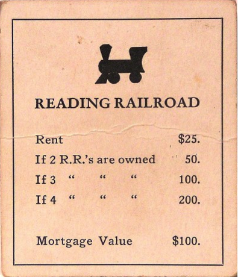

<!--prettier-ignore-start-->
## Getting Started 
{: .no_toc }

Please allow me to point out a few learning resources and explain the MVC design pattern.

The command used to create a new Rails app is also covered below.

### Table of Contents
{: .no_toc }  

1. TOC
{:toc}

<!--prettier-ignore-end-->

## Reading Railroad

{:class="small inline"}

If you haven't already, work your way through the [Getting Started with Rails Tutorial](http://guides.rubyonrails.org/getting_started.html) by coding along while you read. This should take an hour of your time and will expose you to the various components of the Rails MVC workflow.

Familarize yourself with the other [Rails Guides](http://guides.rubyonrails.org/) as well as [the Rails API](http://api.rubyonrails.org/).

\* \* \*

_When you have the urge to Google for some Rails coding help, RTFM instead._

**R**ead **T**hese **F**riendly **M**anuals.

#### Resources

- [How to RTFM](https://web.archive.org/web/20130111060652/http://blog.appamatto.com/2011/11/22/how-to-rtfm.html)

## Model View Controller

{:class="small inline"}

### A Rails application flow chart.

**Routing:** The Rails router determines which controller action to execute. We can map specific URLs to controller actions using the /config/routes.rb file.

**Controller:** The controller acts like a bridge between the Model and the View. The controller requests data from the database by way of the Model. Any data that is saved to an instance variable in the controller will be available in the associated view. Each controller is a Ruby class that extends `ActionController::Base`.

**Model:** The model is our ORM (Object Relational Mapper) which allows us to query our database tables using Ruby code rather than SQL. The results from our queries are wrapped in Ruby objects. Most models are Ruby classes that extend `ActiveRecord::Base`.

**View:** The view is the HTML used to display the data gathered by the controller. The view can also contain embedded ruby code (ERB) which is execute on the server.

**Layout:** The layout is a template HTML document within which all views are displayed. The HTML code common to all views is stored in the layout.

_Not shown here is the source of the request, a user's web browser requesting an URL by way of HTTP._

## Creating a New Rails App

Much of our work with Rails happens at the command line. For example, to create a new Rails application we type the following at a command prompt:

`rails new project_name`

Where `project_name` is the actual name of the project we wish to create. Rails will then generate the file/folder structure of an empty Rails project in the current folder.

By default new Rails apps are configured to use SQLite as their database.

## Creating a New Rails App (PostgreSQL)

Since we have Postgres available on our development environment we can ask Rails to use Postgres instead of SQLite when creating a new rails application:

`rails new project_name --database=postgresql`

You'll need to install and configure Postgres either for Windows or within the WSL. You'll also need to set a Postgres username/password and add this user to the `config/database.yml` file like so:

```yaml
development:
  <<: *default
  username: your_postgres_user # This line was added.
  password: your_postgres_pass # This line was added.
  database: myapp_development
```

After this we must navigate to the project folder and ask Rails to create the database for us:

`cd project_name`  
`rails db:create`

## The Rails Development Server

To test a Rails application we need to start up a local web server. From the Rails application root folder run the following from the command prompt:

`rails server -b 0 -p 3000`

Or for short:

`rails s`

The `-b` binds the server to any local IP address. This is only important if you are running Rails on a VM.

The `-p` sets the server port to 3000. The default port is 3000.
